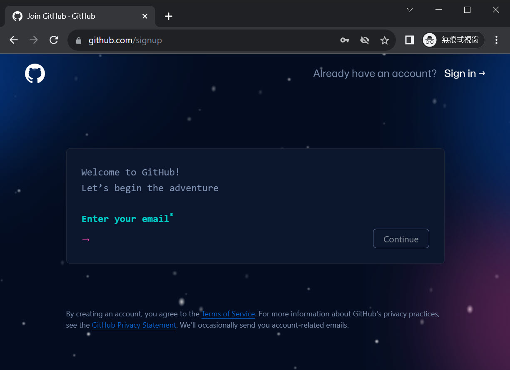
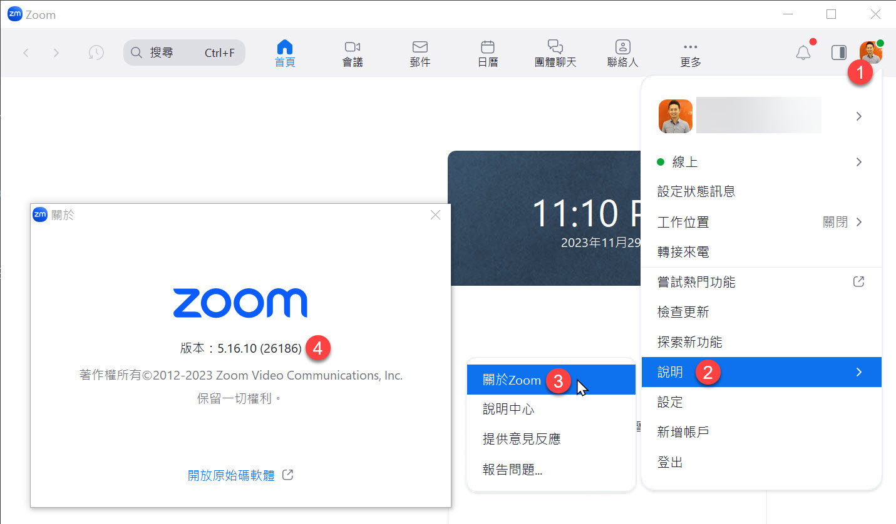
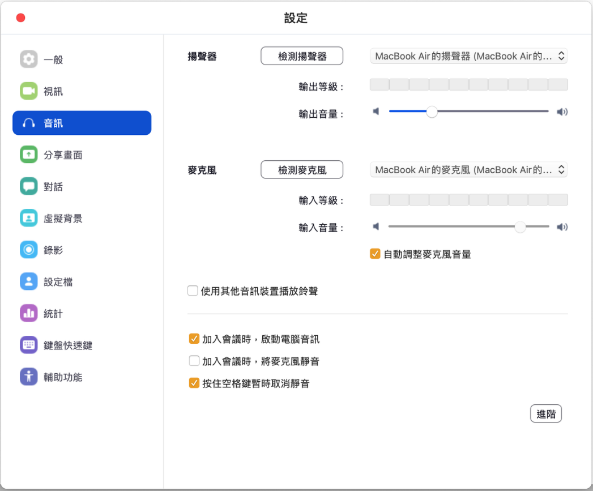

# 精準掌握 GPTs 的 Actions 開發技巧 - 學員課前注意事項


## 課程簡介

想像一下，你只需輕鬆地打開手機，啟動 ChatGPT 網頁，對著精心設計的 GPTs 輕聲說道：「請幫我預定明天下午三點的會議，主題是與部門主管開會報告目前專案進度，會議時間 1 小時。」話音剛落，短短不到 10 秒，你的 Outlook 便靈巧地自動設定好了這一切。更令人驚嘆的是，打造這樣一個 GPT 幾乎不需撰寫任何程式碼，只要會下適當的 Prompt，一切便能如願以償！我只能說：傑克，這真是太神奇了！😃

我原本認為 Actions 很簡單，但不清楚他的威力有多大。直到我完全理解了這一切，才真正領悟到，GPTs 簡潔的外表下，實則隱藏著強大的整合能力。只要你能搞定 API Key 與 OAuth2 的認證方式，GPTs 如同獲得了全世界 API 的鑰匙，像是 M365, Google, Dropbox, Twitter, GitHub, ... 全部都可以輕鬆整合。而且重點是，你幾乎完全不用寫 Code 就可以串接全世界透過 OAuth2 認證的 REST APIs，這是一個開放無限想像空間的全新世界！🤯

這堂課將會在 2 小時內跟你分享所有開發 Actions 的重要技術細節，以及自行開發的 API 與 Actions 整合時的注意事項。這堂課將為開發者們開啟一扇新的大門，帶你體驗 GPTs 的無窮魅力和可能性！👍

## 課程特色

* 本課程不含實作練習部分，所有上課時間將大量展示各種 Actions 開發技巧
* 由 [Will 保哥](https://www.facebook.com/will.fans) 全程線上授課，無地域限制，可即時回應學員任何疑惑
* 學員可透過多種管道提問：Slido、Zoom 聊天室、Zoom 共享桌面
* 課程全程錄影，學員課後 3 個月內可免費無限次重播！

## 報名連結

* 2023.12.15 (五) 20:00 - 22:00 [精準掌握 GPTs 的 Actions 開發技巧 (第一梯次)](https://www.accupass.com/go/gpts-actions) (即將額滿)

## 給學員的話

各位同學大家好：

這堂課是特別設計給開發人員的一堂課，有一定的上手門檻，即便你是工程師，也不見得可能快速上手本次課程將傳授的這些知識與概念，如果可以的話，建議可以事先預習一部分內容。以下我將列出本次課程預計會接觸到的開發技術：

* 要透過 GPTs 串接自己的服務，一定要會寫 Web API，因此你至少要理解以下概念：

  * HTTP Request/Response
  * HTTP Methods (GET/POST/PUT/DELETE)
  * OpenAPI Specification (Swagger)
  * JSON / YAML 格式差異

* 如果要讓 GPTs 串接別人開發的服務，你必須要先學會如何串接別人的 API 服務

  * 了解 REST API 的基本概念
  * 了解 OAuth2 的認證機制 (知道如何串接別人的 OAuth 2.0 服務即可)
  * 瞭解 Bearer Token 的概念 (知道如何在 HTTP Header 帶入 Bearer Token 即可)
  * 使用 Postman 呼叫別人寫好的 API 服務

* 理解 OAuth2 的認證機制 (如果你想串接 OAuth 2.0 的服務)

  * 知道什麼是 `Client ID` 與 `Client Secret`
  * 知道什麼是 `Authorization Endpoint` 與 `Token Endpoint`
  * 知道什麼是 `Redirect URI`

* 理解 Bearer Token 的概念 (如果你想串接需要 API Key 的服務)

  * 其實大多數 B2B 的服務都是透過 API Key 在認證的，例如 OpenAI 的 API 就是以 API Key 來認證的

課堂上並不會教授任何 Web API 開發技巧，如果你對 Web API 開發還不熟悉，建議可以先自行學習。

> 備註: 我最近有發現，很多人現在只要看到 `OpenAPI` 就會自動腦補成 `OpenAI`，請大家看文字的時候要注意，這兩個是完全不同的東西，`OpenAPI` 是一種 Web API 規格，而 `OpenAI` 是一家人工智慧公司。

我知道很多人就算會寫 Web API 可能也不一定會寫 OpenAPI Specification，這裡有一份 [Getting Started \| OpenAPI Documentation](https://learn.openapis.org/) 文件，可以幫助初學者快速上手一些基本概念。這堂課我將會分享許多 OpenAPI Specification 的撰寫技巧，而我當然也會用 GitHub Copilot 示範如何快速開發，大家只要先了解一下 OpenAPI Specification 的基本概念跟語法即可，因為這對 Actions 開發來說是非常重要的，你一定會用到！

我這兩天有設計一款【[懶人通訊錄](https://chat.openai.com/g/g-7mPctxtWq-lan-ren-tong-xun-lu)】GPT，就是使用 Actions 串接 Microsoft 365 的服務，學員們可以先試用看看，看看在 GPTs 上面使用 Actions 的感覺，相信你們在使用過的過程一定會有許多疑惑跟想法，歡迎大家把問題帶到課堂上交流，我將回答所有人的問題。理論上你可以透過 GPTs 的 Actions 串接 Microsoft Graph 的任何一支 API 服務，透過自然語言完成各種辦公作業！😃

以下文件將說明學員上課前的注意事項，請詳細閱讀並提前準備，有任何疑問都歡迎隨時[來信](mailto:training@miniasp.com)洽詢。

## 註冊 GitHub 帳號 (非必要)

如果你想透過 GPTs 串接 [GitHub REST API](https://docs.github.com/en/rest?apiVersion=2022-11-28) 的話，那麼你就需要一個 GitHub 帳號。

如果你想搭配使用 GitHub Copilot 幫你撰寫 OpenAPI Spec. 的話，那麼你也需要一個 GitHub 帳號。

註冊網址：<https://github.com/signup>



## 購買 GitHub Copilot 訂閱方案 (非必要)

我沒有強迫大家要買 [GitHub Copilot](https://copilot.github.com) 訂閱服務，其實你用免費版的 [ChatGPT](https://chat.openai.com/) 或 [Bing Chat](https://www.bing.com/chat) 一樣可以幫助你寫很多程式碼，只是沒有 [GitHub Copilot](https://copilot.github.com) 在使用上這麼方便而已。

購買網址：<https://copilot.github.com/>

點擊 [Buy now](https://github.com/settings/copilot) 按鈕


然後選擇你要購買的方案，目前有兩種方案可供選擇：

1. 月繳 `$10` 美元
2. 年繳 `$100` 美元 (一年可以省下 `$20` 美元)


## 安裝 Visual Studio Code 編輯器

我們課堂上會需要撰寫 OpenAPI Specification 文件，建議你先安裝好 [Visual Studio Code](https://code.visualstudio.com/) 編輯器。[Visual Studio Code](https://code.visualstudio.com) 是一套跨平台的編輯器，支援 Windows、macOS 與 Linux，因此理論上所有人都可以順利安裝與使用，如果你真的有遇到什麼困難，歡迎隨時[來信](mailto:training@miniasp.com)告知。

## 安裝 Visual Studio Code 擴充套件

由於 Visual Studio Code 是一套輕量級的編輯器，它的功能是透過安裝「擴充套件」來增強的。

首先，Visual Studio Code 支援完整的「繁體中文」介面，而且翻譯品質非常好，在首次安裝並啟動 Visual Studio Code 後，該軟體就會提醒你安裝繁體中文套件，建議英文不太好的朋友可以安裝繁體中文版。


如果你的介面沒有自動切換到繁體中文版，那就請透過以下步驟手動切換：


GitHub Copilot 的功能也是透過安裝擴充套件來實現的，你需要安裝以下擴充套件才能順利的使用 GitHub Copilot 工具：

1. [GitHub Copilot](https://marketplace.visualstudio.com/items?itemName=GitHub.copilot)

   

2. [GitHub Copilot Chat](https://marketplace.visualstudio.com/items?itemName=GitHub.copilot-chat)

   

3. [VS Code Speech](https://marketplace.visualstudio.com/items?itemName=ms-vscode.vscode-speech)

   

要編輯 OpenAPI Specification 文件，你需要安裝以下擴充套件：

1. [OpenAPI (Swagger) Editor](https://marketplace.visualstudio.com/items?itemName=42Crunch.vscode-openapi)

   為了讓 OpenAPI 規格的 JSON 內容也可以在 VS Code 編輯器中自動驗證，你可以能還要加上以下設定才行：

   ```json
   {
       "json.schemas": [
           {
               "fileMatch": [
                   "openapi.json"
               ],
               "url": "https://raw.githubusercontent.com/OAI/OpenAPI-Specification/main/schemas/v3.0/schema.json"
           }
       ]
   }
   ```

   > 你可以參考[我的 VS Code 設定](https://gist.github.com/doggy8088/62e3d786826867b39279fd10bc2fabfe)

2. [YAML](https://marketplace.visualstudio.com/items?itemName=redhat.vscode-yaml)

   這個擴充套件會隨著 [OpenAPI (Swagger) Editor](https://marketplace.visualstudio.com/items?itemName=42Crunch.vscode-openapi) 自動安裝，不過有個 3 個設定大家可能要手動調整一下。

   ```json
   {
       "yaml.validate": true,
       "yaml.format.enable": true,
       "yaml.format.singleQuote": true
   }
   ```

   > 你可以參考[我的 VS Code 設定](https://gist.github.com/doggy8088/62e3d786826867b39279fd10bc2fabfe)

3. [YAML ❤️ JSON](https://marketplace.visualstudio.com/items?itemName=hilleer.yaml-plus-json)

   非常方便的 YAML 與 JSON 轉換器！

   可以利用 `YAML+JSON: Preview as YAML (from JSON. Opens in new file)` 指令，快速將 JSON 轉換成 YAML 格式。

4. [Base64](https://marketplace.visualstudio.com/items?itemName=m4ns0ur.base64)

   非常方便的 Base64 編碼/解碼工具！

   

5. [JWT Debugger](https://marketplace.visualstudio.com/items?itemName=yokawasa.jwt-debugger)

   好用的 JWT 偵錯工具，可以在 VS Code 裡面直接解析 JWT Token 的內容。

## 上課前的注意事項

請注意！由於目前 OpenAI 用戶多達一億人，因此 OpenAI 會限制每個用戶 GPT-4 的使用次數：


由於限制條件經常在改變，以我撰文的時間來說，目前的限制為 3 小時內只能提問 40 條訊息，提問超過 40 條訊息後，就會被鎖定 3 小時，這段時間就無法再使用 GPT-4 或 GPTs。


因此，為了避免上課時無法使用 GPT-4，請各位學員在**上課前 3 小時**，**不要使用 ChatGPT**，以免上課的時候無法參與練習的環節。

> 備註: 這是因為 GPTs 的背後就是使用 GPT-4 模型，因此練習設計 GPTs 的過程，也會受到 GPT-4 的使用限制。

由於我們上課時會採用 [Zoom](https://zoom.us/zh-tw/download) 軟體進行授課，因此請學員在上課前先安裝好 [Zoom](https://zoom.us/zh-tw/download) 軟體的最新版，並且測試好麥克風與喇叭是否可以正常運作，以免上課時無法順利聽到課程內容。

以下幾點請在上課前確認完畢：

1. 檢查 Zoom 是否為最新版本

   我這邊目前最新的 Zoom 版本為 `5.16.10` (26186)

   

2. 檢查 Zoom 麥克風與喇叭是否正常運作

   你可以透過 Zoom 的測試功能來檢查麥克風與喇叭是否正常運作，如果你的麥克風與喇叭都正常運作，你會看到以下畫面：

   

## 上課時的注意事項

1. 你可以在課程開始前 30 分鐘進入 Zoom 會議室，以下是進入會議室的步驟

   開啟 Zoom 軟體，點擊「加入會議」

   

   輸入我們課前通知的「會議號碼」與「顯示名稱」

   

   輸入會議密碼

   

   測試喇叭和麥克風

   

   請務必測試一下麥克風與喇叭是否正常運作，以免上課時無法順利聽到課程內容。

   

   進入會議室之後，如果聽的到聲音，就按下「回應」的 ✅ 按鈕。

2. 多利用「回應」功能給予課程回饋

   過往有許多同學都找不到 Zoom 的「回應」功能，我特別截圖跟大家說明怎樣操作。

   

   基本上在 Zoom 最下方的工具列上，會有個「回應」的按鈕，按下去之後會有三排的表情符號可以按：

   第一排：這些表情符號按下之後可以表達你在課堂上的心情，而且 10 秒之後就會自動消失。這些表情非常重要，因為這可以讓講師知道你當下的心情，感覺開心的時候可以選 😂 (大笑)，聽到很厲害的內容時可以按下 👍 (讚)、❤ (愛心)、👏 (拍手)、🎉 (獻花) 等表情，這可以讓課程變的相當活絡有趣！

   第二排：這些符號按下去之後就不會自動消失，主要用來回應講師的提問，方便大家回答問題。例如講師問「大家都聽的到我的聲音嗎？」，你可以按下 ✅ (打勾) 來回答「聽的到」，或是按下 ❌ (叉叉) 來回答「聽不到」，這樣講師就可以知道你的聲音是否正常。

   第三排：只有一顆「舉手」的按鈕，按下去代表你想要開麥克風發言，講師會看到你的舉手，然後依序讓你發言。先按「舉手」的人會排在最上面，講師會更容易看到你的舉手狀態。

3. 利用【聊天室】來向講師或學員傳達訊息

   Zoom 軟體有個「聊天」功能，但請不要在「所有人」的視窗聊天，因為很多人一起聊天的結果，就是大家都找不到訊息。

   這個「聊天室」功能主要用來讓學員與講師之間的溝通，如果你有任何問題，可以在「聊天室」中發問，講師、助教或其他學員都會盡量回答你的問題。

   留言時，請務必在一個訊息中把問題打完，不要像 LINE 一樣，想到一句打一句，否則可能會不同人發問的問題之間交錯出現，導致閱讀困難。

4. 利用【麥克風】使用語音提問

   進入會議室之後，麥克風會處於「鎖定」的狀態，如有問題想透過語音發問，請先點擊 Zoom 軟體的「舉手」按鈕，講師會開啟你的麥克風讓你線上發問。

   如果講師需要學員進行語音互動時，願意發言的人，也可以先按下「舉手」等候講師呼喚，並準備開啟麥克風，這樣才不會花太多時間等待學員回應。

5. 不開放【視訊】使用

   原則上我們上課不需要開啟視訊鏡頭，以確保大家的個人隱私。

6. 使用 [Slido](https://www.slido.com/) 來提問

   請多利用 [Slido](https://www.slido.com/) 來進行提問，我們的【上課通知】郵件會包含 Slido 的活動代碼。

   你只要進入 [Slido](https://www.slido.com/) 網站，並且輸入「活動代碼」就可以進入本次課程的提問介面。

   

   提問時可以「匿名」，也可以「具名」，你可以自行決定要如何提問。

   

   提問前，請先看看是否有其他同學已經問了類似的問題，如果有的話，可以直接按讚，因為講師會優先回答讚數較高的提問。

   

## 請注意查收【上課通知】信件

我們會在上課前一兩天發送「上課通知」信件給學員，信件內容包含：

1. 寄件者：`training@miniasp.com`

2. 郵件主旨：`【上課通知】精準掌握 GPTs 的 Actions 開發技巧 1215`

3. 郵件內容：包含課前注意事項、進入 Zoom 會議室的「會議號碼」與「會議密碼」、進入會議室之後的「顯示名稱」、Slido 提問網站的「活動代碼」等資訊。

如果你沒有收到通知郵件，請立即[寫信](mailto:training@miniasp.com)與我們聯繫！🔥
